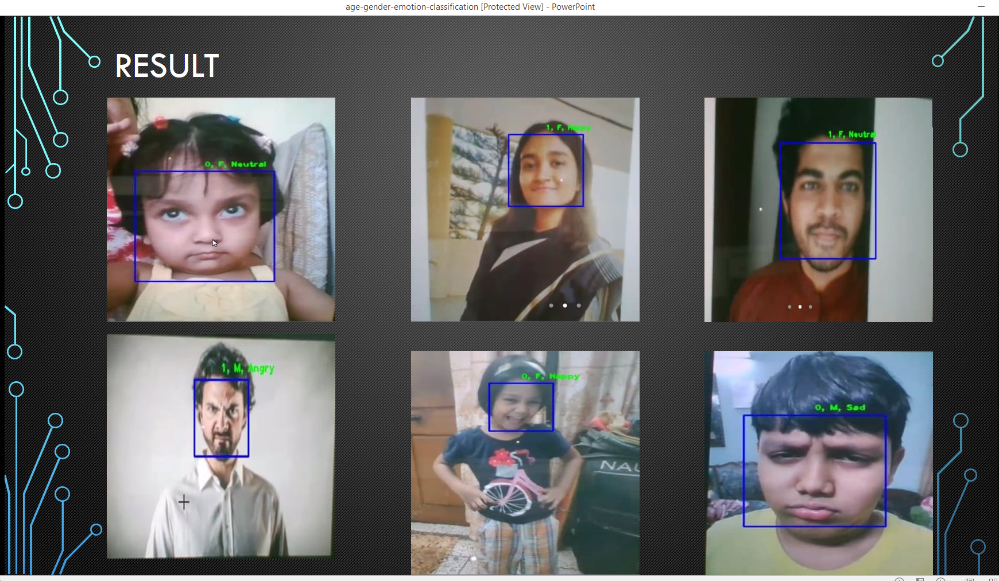
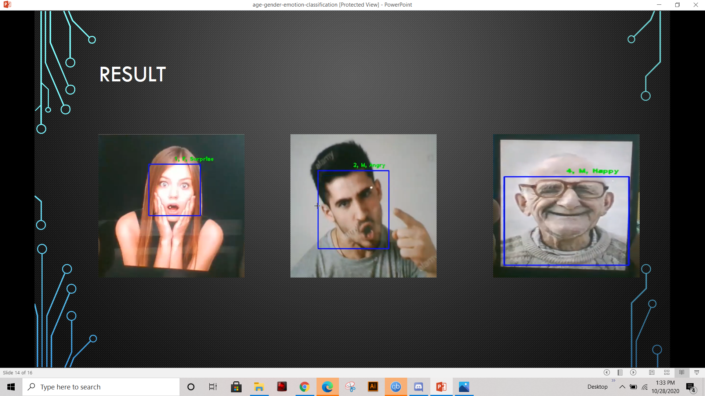

# Real Time Age Gender & Emotion Surveillance Camera

In this project, we performed the task of classifying age, gender and emotion of human beings. We firstly designed seperate CNN architectures for each oof the three tasks. Later on, after analyzing we implemented our seperate multitask model. This multitask model allows us to classify age and gender with a single CNN architecture. Such models are more difficult to train but they are more efficient. We used UTKFace dataset and implemented the codes in Tensorflow 2. After that, we extended the project to test the results in real time. It can be implemented with the help of webcam of our pc or on raspberrypi with Tensorflow Lite. The results and presentation of the project are also given in this repo.

